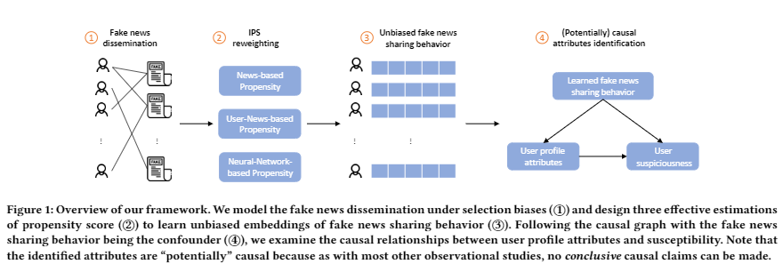

# Causal-Understanding-of-Fake-News-Dissemination
Implementation of our KDD21 paper Causal Understanding of Fake News Dissemination on Social Media [1]

## Code usage
1. Run the script [user_attribute.py](user_attribute.py) to preprocess data.
2. Run the script [create_bipartite.py](create_bipartite.py) to creat the user-news bipartite graph.
3. To get the News- and User-News-based propensity score estimation, run the script [pscore.py](pscore.py) and [pscore_ut.py](pscore_ut.py), respectively. 
4. For the method BPRMF, simply run [BPRMF.py](BPRMF.py), [BPRMF_t.py](BPRMF_t.py), [BPRMF_ut.py](BPRMF_ut.py), and [BPRMF_neural.py](BPRMF_neural.py). They correspond to the biased model and unbiased models using news-, user-news-, and neural-network-based propensity score estimations. This also applies to the method NCF. 
5. Note that the main programs (BPRMF.py or NCF.py) mostly are adapted from code for paper [Neural Graph Collaborative Filtering](https://arxiv.org/abs/1905.08108).

### Python packages version
* python == 3.7
* tensorflow == 1.14.0

### Reference
> \[1\] [Lu Cheng](http://www.public.asu.edu/~lcheng35/), [Ruocheng Guo](https://www.public.asu.edu/~rguo12/), [Kai Shu](http://www.cs.iit.edu/~kshu/) and [Huan Liu](http://www.public.asu.edu/~huanliu/). Causal Understanding of Fake News Dissemination on Social Media. *ACM SIGKDD Conference on Knowledge Discovery and Data Mining (KDD)*, 2021.

